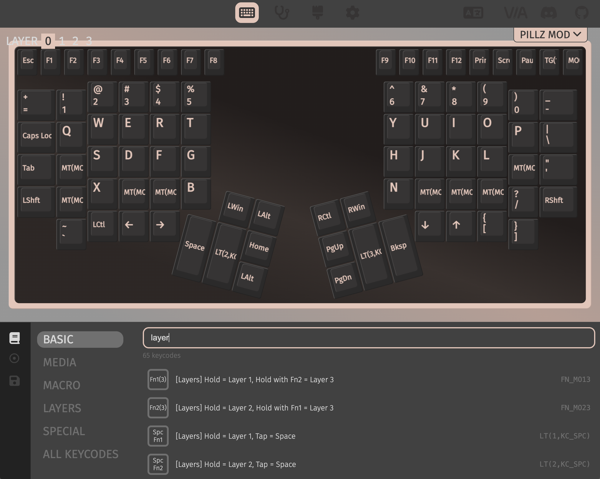

# VIA All Keycodes – Chrome Extension



A Chrome extension that adds a searchable **"All Keycodes"** master list to the [VIA keyboard configurator](https://www.usevia.app/).

## Features

### Searchable Keycode List

- **Persistent search bar** at the top of the keycode pane — always visible regardless of which category is selected
- Filters across all categories (Basic, Media, Layers, Special, Lighting, Macro, Custom) by name, code, or description
- List layout with a mini key icon, human-readable name, and QMK code for each entry
- Result count shown below the search bar

### "All Keycodes" Category

- New **All Keycodes** menu item in the sidebar, inserted after "Special"
- Displays the full de-duplicated master list of every keycode (~370+)
- Each entry is tagged with its source category (e.g. `[Basic]`, `[Special]`)

### VIA Integration

- Clicking a keycode opens VIA's native **"Any" keycode modal** with the code pre-filled
- Falls back to **clipboard copy** if a key isn't selected on the keyboard
- Moves VIA's native **"Any" button to the first position** in the Special category

### Keyboard Shortcuts

| Shortcut                | Action                                               |
| ----------------------- | ---------------------------------------------------- |
| `⌘K` / `Ctrl+K`         | Focus the search bar                                 |
| `↓` or `Tab`            | Move from search to first result, or to next result  |
| `↑` or `Shift+Tab`      | Move to previous result, or back to search bar       |
| `Enter` or `Space`      | Activate the focused keycode (opens modal or copies) |
| `Escape`                | Clear search and return to search bar                |
| Typing on a focused row | Jumps back to search bar with the keystroke          |

## Development (Hot Reload)

This extension uses [Vite](https://vitejs.dev/) + [@crxjs/vite-plugin](https://crxjs.dev/vite-plugin) for development with **hot module reloading**.

### Prerequisites

- Node.js 18+
- npm or bun

### Setup

```bash
cd via-keycode-extension
npm install
```

### Dev Mode (HMR)

```bash
npm run dev
```

> **Note:** Run from the `via-keycode-extension/` directory, not the parent workspace. If you see the wrong Vite config resolving, use `./node_modules/.bin/vite` directly.

This will output a `dist/` folder. To load in Chrome:

1. Open `chrome://extensions`
2. Enable **Developer mode** (top right toggle)
3. Click **"Load unpacked"**
4. Select the `via-keycode-extension/dist` folder
5. Navigate to [https://www.usevia.app/](https://www.usevia.app/)
6. Connect a keyboard and open the Configure > Keycode pane

Changes to source files will auto-rebuild and the extension will hot-reload in Chrome.

### Production Build

```bash
npm run build
```

The built extension is in `dist/`.

## How It Works

The extension injects a **content script** into the VIA webapp that:

1. Uses a **MutationObserver** (no polling) to detect when VIA's keycode pane renders
2. Injects a **sticky search bar** at the top of the keycode content area
3. Inserts an **"All Keycodes" row** after the "Special" category in the sidebar
4. Search and "All Keycodes" show a **position-absolute overlay** on top of VIA's React DOM (without destroying it), so switching back to native categories works seamlessly
5. Clicking a keycode **dispatches native click events** on VIA's "Any" button to open the `KeycodeModal`, then **fills the input** using the native value setter to bypass React's controlled input
6. Moves VIA's existing "Any" DOM element to the first position in the Special grid

### Technical Notes

- VIA uses **React 17+** which attaches event listeners at the root, so `dispatchEvent(new MouseEvent('click', {bubbles: true}))` correctly triggers React handlers
- React's controlled inputs require using `Object.getOwnPropertyDescriptor(HTMLInputElement.prototype, 'value').set` to bypass the synthetic setter, followed by dispatching `input` and `change` events
- The overlay uses `position: absolute` to cover VIA's content without calling `innerHTML = ''`, which would destroy React's managed DOM tree
- All styles use VIA's CSS custom properties (`--bg_control`, `--color_accent`, etc.) to match the current theme

## Project Structure

```
via-keycode-extension/
├── manifest.json          # Chrome Extension manifest v3
├── vite.config.ts         # Vite + CRXJS config
├── package.json
├── tsconfig.json
└── src/
    ├── content/
    │   ├── index.ts       # Main content script (DOM injection, search, keyboard nav)
    │   └── styles.css     # Injected styles matching VIA's theme variables
    ├── data/
    │   └── keycodes.ts    # Complete keycode database (extracted from VIA source)
    └── assets/
        └── icon*.png      # Extension icons (16, 48, 128)
```

## Known Limitations

- **The "Any" modal flow requires a key to be selected** on the keyboard first. If no key is selected, the extension falls back to copying the keycode to the clipboard.
- **Keycode data is a static snapshot** from VIA's source. If VIA adds new keycodes, `src/data/keycodes.ts` needs to be updated to match.
- **DOM selectors are heuristic** — they find VIA's elements by text content and structure rather than class names (which are randomized by styled-components). If VIA changes its layout significantly, the selectors may need updating.
